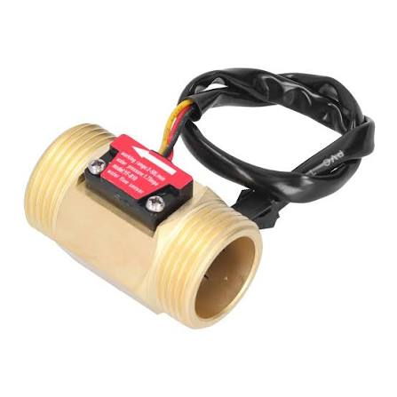
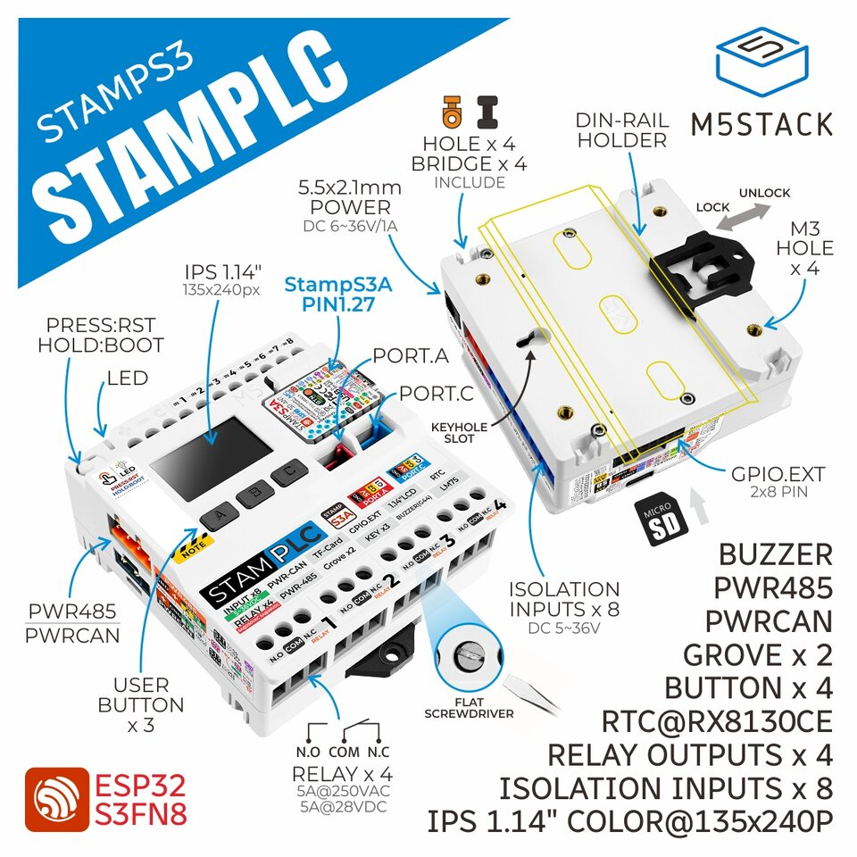

# Water Flow Meter — StampPLC

A water-flow meter on an **M5Stack StampPLC** (ESP32-S3). It measures up to eight pulse-output
flow sensors, publishes readings over **Modbus RTU**, and has a 240×135 landscape display driven
by **three buttons**.

<table align="center">
  <tr>
    <td align="center" valign="middle">
      
    </td>
    <td align="center" valign="middle">
      <a href="https://docs.m5stack.com/en/core/StamPLC">
        
      </a>
    </td>
  </tr>
  <tr>
    <td align="center" valign="top">
      <sub><b>The sensor.</b> A pulse-output Hall-effect flow sensor of the YF-B10 kind the
      requirements name. Water turns a rotor inside, and each turn sends pulses down the cable, a
      fixed number per litre (476 for the YF-B10).</sub>
    </td>
    <td align="center" valign="top">
      <sub><b>The controller.</b> Up to eight sensors wire to the isolated inputs. PWR485 carries
      Modbus RTU, and the 1.14" screen with its three buttons is the UI this repository designs.
      Image © M5Stack, from the <a href="https://docs.m5stack.com/en/core/StamPLC">product documentation</a>.</sub>
    </td>
  </tr>
</table>

The distinctive part, and the thing to understand before changing anything: **the on-device UI
is designed in a web app, exported to JSON, and translated into `constexpr` C++ tables that the
firmware renders.** Nothing about the screens is hand-written in the firmware.

### Why the UI is designed in a web app

A 240×135 panel with three buttons is a hard place to iterate. Every label change, layout tweak
or new menu path would otherwise cost a C++ edit, a firmware build and a reflash, and someone would
need the device on their desk to see the result. `web/mockup/` takes all of that off the hardware:

- **See it without a device.** The browser shows every screen at the panel's exact pixel size, so
  you can check layout, fonts and colours before anything is built.
- **Try the buttons for real.** `ArrowUp`, `ArrowDown` and `Enter` work like the three device
  buttons, with the same short-press, long-press and hold timings, so you can walk through
  navigation, editors and countdowns in the browser.
- **One source for the screens.** The design is saved as data (`src/data/screens.json`), not
  code. The exporter turns it into C++, and its gates refuse any export that refers to a screen,
  action or value the firmware does not have (see **The pipeline** below).
- **Keep the device logic stable.** Generated UI code lives apart from the measurement, Modbus
  and diagnostics code, so redesigning a menu can't break pulse counting.

The original rationale is in
[`Display_Web_Mockup_and_Translator.md`](docs/Requirements/feature%20addition/Display_Web_Mockup_and_Translator.md),
and the tool's own guide is [`web/mockup/README.md`](web/mockup/README.md).

### Documentation: the wiki

**[github.com/ciberkids/water-flow-meter-StampPLC/wiki](https://github.com/ciberkids/water-flow-meter-StampPLC/wiki)**
is the reference for anyone connecting to the device rather than changing its code:

| Page | Covers |
| --- | --- |
| [Home](https://github.com/ciberkids/water-flow-meter-StampPLC/wiki) | Orientation: where to look for each task |
| [Communications](https://github.com/ciberkids/water-flow-meter-StampPLC/wiki/Communications) | The three ways to talk to the device (Modbus RTU, MQTT, WiFi), what each can do, and units on every wire |
| [Modbus Registers](https://github.com/ciberkids/water-flow-meter-StampPLC/wiki/Modbus-Registers) | The register map, generated from the firmware headers |
| [MQTT](https://github.com/ciberkids/water-flow-meter-StampPLC/wiki/MQTT) | Telemetry topics, payloads and Home Assistant discovery |
| [WiFi](https://github.com/ciberkids/water-flow-meter-StampPLC/wiki/WiFi) | Turning WiFi on, provisioning, and the radio's states |
| [Screen Navigation](https://github.com/ciberkids/water-flow-meter-StampPLC/wiki/Screen-Navigation) | Every screen on the panel and how the buttons move between them, generated from the dataset |
| [Screen Gallery](https://github.com/ciberkids/water-flow-meter-StampPLC/wiki/Screen-Gallery) | A picture of every screen in the default menu, captured from the web designer |
| [UI Dataset Contract](https://github.com/ciberkids/water-flow-meter-StampPLC/wiki/UI-Dataset-Contract) | The rules a `screens.json` must follow |

The wiki is not edited by hand. `tools/wiki/sync.sh` builds it from this repository and CI
publishes it on every push to `main`, so it always matches `main`. To change a page, edit its
source in the repo and commit: `tools/wiki/pages/` for the long pages, `sync.sh` itself for Home
and UI Dataset Contract, `gen-registers.mjs` for the register map.

---

## Verify the checkout in four commands

Run these before trusting any document in this repository, including this one.

```bash
# 1. Host tests — no PlatformIO, no container, ~2 seconds
Water-Flow-Meter-PlatformIO/test/host/run.sh

# 2. Web suites
cd web/mockup && npm ci && npx tsc --noEmit && npm run test:unit && npm run test:exporter

# 3. The export gates
npm run export:firmware

# 4. Firmware compiles (build the image once, ~5 min)
cd ../../Water-Flow-Meter-PlatformIO && podman build -t stampplc-fw .
podman run --rm -v "$PWD":/workspace:Z -w /workspace stampplc-fw pio run -e m5stack-stamplc
```

Expected, **measured 2026-08-25 on this branch**: host suite exit 0 with **2,035 checks across 26
suites, 0 failures** and "manifest is up to date"; **220 unit tests in 13 files**; **51 exporter
tests**; **51 visual tests**; **7 catalogue-policy tests** (`node --test "tools/catalogue/*.test.mjs"`); export `ok` with **9 gates passing and 1 warning** (no dataset element
surfaces a fault summary — the §2c banner is firmware-drawn). Firmware SUCCESS at **RAM 24.6 % /
Flash 39.0 %**.

**Firmware size figures changed on 2026-08-26 without a source change**, from Flash 38.2% to 39.0%. The cause is recorded in `platformio.ini`: two dependencies were bare git URLs and two more floated on a caret range, so the podman container and CI had been resolving DIFFERENT versions — the container cached M5StamPLC 1.1.0 and M5GFX 0.2.17 while CI took 1.2.0 and 0.2.28. All four are pinned now and 39.0% is what a fresh clone actually builds.

**The visual suite is green now, and it is the fifth command.** `npm run test:visual` (Playwright)
passed **51 of 51** on this measurement. It failed 32 of 46 until **`DF17`** was fixed on 2026-08-18,
and this paragraph said so until 2026-08-20 — two days after the repair, which is the same
stale-status failure the open register was rewritten to undo. It builds before it renders (`tsc &&
vite build && playwright test`); running Playwright directly tests a stale `dist/` and has wasted two
rounds doing exactly that.

The `:Z` on the volume mount is required on SELinux hosts (Fedora, RHEL). Without it the
container sees an empty workspace.

**Start with command 1.** It runs the device harness — the real navigator, controller,
interaction handler and action registry against the real **79-screen** table, with only three
Arduino headers stubbed. It is the fastest way to find out whether the tree is sound, and it
needs no toolchain at all.

---

## The pipeline

```
web/mockup (React)  ──►  src/data/screens.json  ──►  tools/exporter  ──►  GeneratedUi.{h,cpp}
      designer               the dataset              the translator        constexpr tables
                                                            │
                          tools/manifest_gen  ──►  actionManifest.json
                        (reads the FIRMWARE catalogues)   what the firmware can do
```

Three vocabularies have to agree across a browser, a Node exporter and a firmware build:
**screen ids**, **action ids** and **binding ids**. Nearly every serious bug in this project has
been a disagreement between them — a screen the router looked for and the dataset didn't have, an
action the designer could wire to nothing, a binding that rendered blank.

That is what the gates exist for. `npm run export:firmware` runs ten of them and refuses to
write assets that would not work:

| Gate | Stops |
| --- | --- |
| `manifest-screen-coverage` | A screen the firmware resolves by name being absent or renamed |
| `manifest-action-coverage` | A flow wired to an action no handler implements |
| `manifest-value-coverage` | An element bound to a value that does not exist |
| `firmware-binding-coverage` | A bound value `UiBindingResolver` has no case for — it renders blank |
| `firmware-manifest-resolvable` | The same, for every value the manifest *advertises*, not just those in use |
| `renderable-element-kinds` | An element kind the firmware cannot draw |
| `led-legend`, `countdown-overlay`, `diagnostics-banner` | Required affordances going missing |
| `platformio-compile` | Generated assets that do not compile |

The manifest is **generated from the firmware's own catalogues**, not maintained by hand, and
`test/host/run.sh` fails if the committed copy is stale. Action ids are cross-checked against
their handler table by `static_assert`, so advertising an action with no handler is a build error.

---

## Layout

| Path | What |
| --- | --- |
| `Water-Flow-Meter-PlatformIO/` | Firmware. `src/{input,led,modbus,sensors,ui}`, `tools/manifest_gen/`, `test/host/` |
| `web/mockup/` | Design tool, exporter (`tools/exporter/`), skeleton generator (`tools/skeleton/`) |
| `docs/` | Requirements, decisions, hardware references — see **Source of truth** below |
| `graphics/` | SVG assets and captured previews |
| `.github/workflows/ci.yml` | Three jobs on every push: web + exporter, host tests, firmware compile |

---

## Working on it

### Firmware

```bash
cd Water-Flow-Meter-PlatformIO
test/host/run.sh                     # host tests + manifest freshness
podman run --rm -v "$PWD":/workspace:Z -w /workspace stampplc-fw pio run -e m5stack-stamplc
```

A local `pio run` works if you have PlatformIO installed; the container is what CI mirrors.
There is **no** `pio test` target — the unit tests are the host suite in `test/host/`, built
straight with `g++` and `-Werror`. That `-Werror` is deliberate: the manifest generator relies on
`-Wswitch` to make "added a setting kind without teaching the generator" a build failure rather
than a warning nobody reads.

Adding UI behaviour? Put the test in `test/host/interaction_test.cpp`. It drives the real
firmware with a fake button source, so gestures, navigation, editors and countdowns are all
testable without hardware.

### Design tool and exporter

```bash
cd web/mockup
npm ci                               # not npm install — the lockfile is authoritative
npm run dev
```

Then edit screens in the browser and press Export. The dataset you see is what gets exported —
it is POSTed with the request rather than re-read from disk.

Commit the dataset and the regenerated assets **together**. CI fails if they disagree.

The wiki's Screen Gallery updates itself: CI captures every screen from the designer on each run and
publishes the pictures with the wiki from `main`, so there is nothing to re-run after a menu change.
`npm run capture:screens` writes the same pictures into `graphics/screens/` (gitignored) to preview locally.

`tools/skeleton/generate.mjs` regenerates the default menu from the catalogue and refuses to emit
one that leaves any setting unreachable. Run it after adding a firmware setting.

### Requirements

Node **22** (CI pins it; `engines` allows ≥20). PlatformIO or Podman/Docker for firmware.

---

## Source of truth

Documentation here has been wrong in both directions — requirements describing machinery that does not
exist, and status files reporting finished work as pending. An audit on 2026-08-01 found 50 false claims
across 17 documents. The defence is that **each question has exactly one file that answers it**, and no
other file restates the answer:

| Question | The file that answers it |
| --- | --- |
| **What is open, and what is its status** | **`docs/active_work/open_decisions.md` — the single source of truth for open work.** Nothing else in this repository keeps an item list |
| What the panel does, screen by screen | `docs/Requirements/feature addition/Display_Per_Screen_Spec.md` |
| What every gesture does, as built | `docs/Requirements/Gesture_Reference.md` — every ✅ names the test that earns it |
| The Modbus register map | `docs/Requirements/Project_document.md` §4.1–§4.2, verified against the headers; `tools/wiki/gen-registers.mjs` generates the reference |
| WiFi, MQTT, Home Assistant, the network registers | `docs/Requirements/feature addition/WiFi_MQTT_Connectivity.md` |
| How the four JSON artefacts relate, and the ten gates | `docs/Requirements/feature addition/UI_Dataset_Contract.md` |
| What happened last session, and what to know before touching this | `MEMORY.md` — handoff narrative and ordering advice **only**; its item list was consolidated into the register on 2026-08-18 |
| Whether a number in any document is current | Nothing. Re-measure it — the four commands above are the whole verification surface |

### Citing open work

Every item in the register carries a **stable ID**, governed by rule **I3** there: `DF`-numbers for
defects, `J` for residue and hygiene, `G1`/`N-b`/`N-c`/`N-d1`/`N-d2` for the unbuilt and unmeasured,
`I2`/`I3` for standing rules. They are append-only — never renumbered, never reused, so a gap means an
item closed. **Cite the ID**, in conversation and in commit messages, and read the index at the top of
that file for the current set with each item's status and shape. Counts live in the index and are
deliberately not repeated here.

### Documents known to be wrong

Each is an item in the register, so it has an owner and a diagnosis rather than a warning label:

| Document | | State |
| --- | --- | --- |
| `docs/Requirements/Implementation_Alignment_Report.md` | — | A **dated snapshot** (against Project_document v1.0, Oct 2025) of a firmware that was one file. Not a live document and not tracked as an item; read it as history or not at all |
| `web/mockup/README.md` | ~~**J4**~~ | **Fixed 2026-08-18.** It had nine false claims, not the three recorded — including a second "the bundled dataset is empty" and two story ids that do not exist |
| `docs/Requirements/feature addition/UI_Firmware_Interface.md` | ~~**J5**~~ | **Fixed 2026-08-18.** Its action table is now generated from `kActionCatalogue` by `tools/wiki/gen-actions.mjs` and gated by a CI diff. It had been advertising two actions that no longer exist |

Any document not named here is *unaudited*, not *verified* — the 2026-08-01 sweep covered 17 of them and the
register has found more since.

`Loadable_UI_Menu_Packs.md` **is built**: the `.uipack` format, its reader, the SD storage adapter, the
loader, the firmware-drawn selector, the boot-time selection ladder and the SPI arbitration all exist
under `Water-Flow-Meter-PlatformIO/src/ui/pack/` and `src/bus/`. What is *not* built is the versioning
that keeps a third-party pack valid as the catalogue grows — **N-b**.

The register's own history is preserved verbatim in `docs/archive/open_decisions-closed-2026-08-12.md`,
including the caveat that used to sit here (✅ meaning *agreed* rather than *landed*). That is history,
not a work list.

---

## Nothing has run on hardware

Not once. The firmware compiles on two independent toolchains and passes 2,035 host checks, but the
RS485 pin assignment, the LED behaviour and every gesture and timing are verified only against
the datasheet, the specifications and those tests.

The first bring-up should measure `pollingRate_kHz` (published on holding register 0 and shown on
the diagnostics screen) — it is open decision **G1**, and it is also a prerequisite for the WiFi
work, whose acceptance criterion budgets against a radio-off baseline that does not exist yet.
