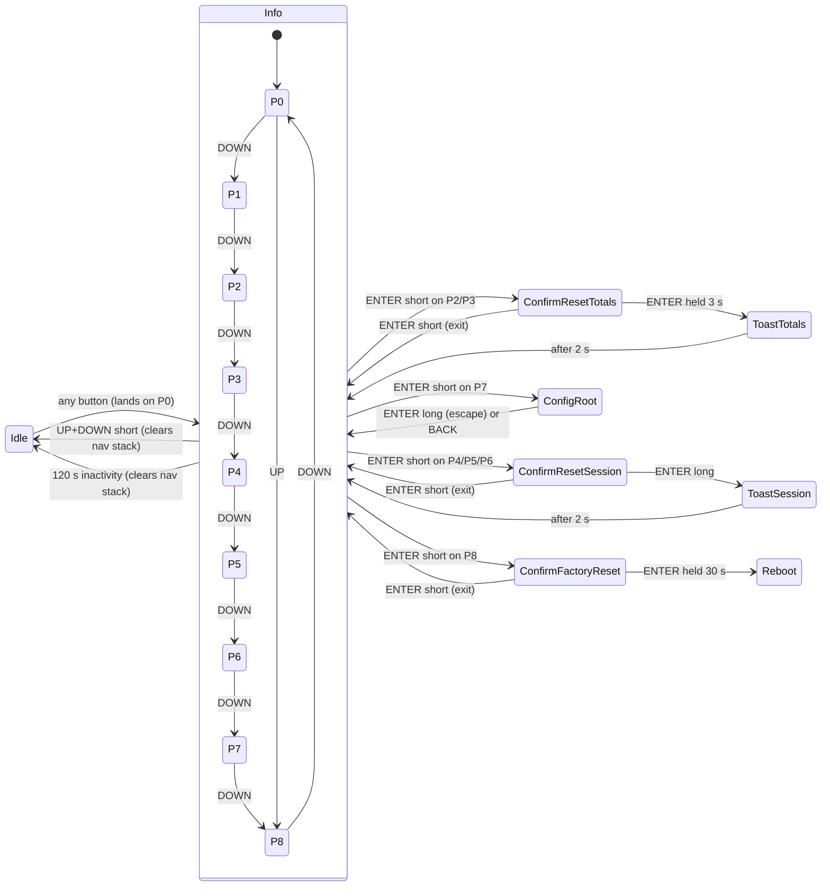

# Requirement: On-Device UI for Display and Buttons

**Version:** 0.2
**Date:** 2026-07-30

> **0.2 — hierarchical navigation model.** §3, §4.1, §4.3, §5 and §6 are revised per
> [`NF-20260730-01-menu-navigation-model.md`](../../new%20feature%20proposal/NF-20260730-01-menu-navigation-model.md).
> Summary of what changed and why:
>
> - **ENTER is no longer overloaded.** 0.1 gave ENTER-long three meanings — global
>   back-to-idle (§4.1), arm a reset countdown (§4.3) and cancel an edit (§5.1). No firmware
>   can satisfy all three, which is why Configuration mode was never implemented.
> - **Navigation is now a tree.** Every level is a ring of sibling pages ending in `BACK`.
> - **Display-off moves to UP + DOWN**, freeing ENTER-long to mean "escape" everywhere.
> - **Factory reset moves from the blind UP+DOWN combo to page P8** with a confirm screen.
> - **Destructive actions get confirm screens and acknowledgement toasts** instead of
>   countdowns armed straight from an info page.
> - **Editing happens on its own screen**, not via an invisible mode flag, so the web design
>   tool can preview every state.
> - Display orientation is **landscape 240 × 135** (decision D3); Modbus slave ID range
>   corrected to **1–247** (decision A2); baud rate is stored as a **list index** (A4).

---

## 1. Purpose

Define the functional requirements for leveraging the StampPLC’s integrated display and three hardware buttons to present live system metrics and allow local configuration while staying aligned with the Modbus feature set described in `docs/Requirements/Project_document.md`.

---

## 2. Hardware Context & Assumptions

- 1.14″ ST7789V2 display, native resolution 135 × 240, driven **landscape: 240 wide × 135 tall** (`display.setRotation(1)`). See `../../hardware docs/StampPLC specifications.md`. All screen layouts are authored to 240 × 135.
- Three physical momentary buttons mapped to MCU GPIOs with interrupt support via the PI4IOE5V6408 expander (I²C SCL = GPIO15, SDA = GPIO13, INT = GPIO14, RST = GPIO3; key lines `KEYA/B/C`, see `../../hardware docs/StampPLC pin map.md`).
- One tri-colour status LED (RGB) driven from the same expander (`P6/P5/P4`) following the behaviour defined in `RGB_LED_Behavior.md`.
- Firmware already exposes sensor state, session counters, cumulative totals, polling rate, and configuration via Modbus registers.
- Polling task publishes `pollingRate_kHz`; this value must be used for Nyquist-style validation when saving sensor parameters.
- Every screen must fit one display without scrolling. A level with more entries than fit shows a scroll indicator.

---

## 3. Button Interaction Model

### 3.1. Gesture contract

The long-press threshold is **1.5 s** — this is the *gesture* boundary. Durations longer
than that (3 s, 30 s) are always **countdowns** shown on screen, never gesture thresholds.

| Gesture | Meaning |
| :--- | :--- |
| UP / DOWN short | Previous / next sibling at the current level (wraps), or −1 / +1 in a value editor |
| UP / DOWN held | Repeat every 250 ms when navigating; accelerating adjust in a numeric editor (§5.4) |
| ENTER short | Descend into the current entry, or commit, or exit — depends on screen type, see §3.2 |
| ENTER long (≥1.5 s) | Escape to the main screen, or discard, or confirm — see §3.2 |
| UP + DOWN short | **Display off, and reset navigation to P0.** Works from any screen at any depth. |
| Any button while idle | Wake the display; the UI is already at P0 (unchanged) |

**UP + DOWN clears the navigation stack**, so the display always wakes on P0 rather than
wherever the operator happened to be. This makes waking deterministic and matches §4.1's
"P0 is the landing page from Idle". Any uncommitted edit is discarded.

For the same reason the **120 s inactivity timeout also resets to P0** — otherwise waking
would be predictable after a manual off but arbitrary after an automatic one.

### 3.2. ENTER depends on screen type — deliberately

| Screen type | ENTER short | ENTER long |
| :--- | :--- | :--- |
| **Navigation** (info pages, menu levels) | Descend into the current entry; on `BACK`, ascend one level | Escape to the main screen (P0) |
| **Value editor** | **Commit** and ascend one level | **Discard** and ascend one level |
| **Confirm** (destructive action) | **Exit** without acting | **Confirm** the action |

Editors put the easy gesture on the common outcome (you usually save); confirm screens put
it on the safe one (you usually back out). The irreversible action therefore always
requires the deliberate gesture.

> Because the mapping is not uniform, **the footer legend must state it on every screen**
> (§6). The three screen types are visually distinct — an editor shows a value, a confirm
> screen asks a question — so the legend is a reminder rather than the only cue.

### 3.3. Retired from 0.1

The **UP + DOWN held 30 s** factory-reset combo is removed. A blind combo is
undiscoverable, gives the operator no indication they are seconds away from wiping the
device, and cannot report what happened. Factory reset is now page **P8** with a confirm
screen (§4.3). LED suppression during the reset countdown is unchanged in behaviour — only
the trigger differs (see `RGB_LED_Behavior.md`, `Project_document.md` §5.3 item 4).

> **Recovery with an unusable display.** The retired combo worked blind. If the display
> fails, use Modbus register 20 (`Master Reset All Configs`).

---

## 4. Display Info Mode

### 4.1. State Machine

Info mode is the root level (L0) and therefore has no `BACK` entry. `P0` is the landing
page from Idle.



Configuration mode's internal structure is specified in §5.

### 4.2. Global Flow Indicator (Animated Dots)

- The **Global Status** page (P0) is the first screen shown from Idle, showing aggregated system telemetry (Total L/s and Total L) and a central flow indicator.
- The flow indicator consists of a pair of dots:
  - When no flow is detected across the system (`aggregateFlowLps == 0.0`), a single red dot is shown statically.
  - When flow is detected, two blue dots appear and disappear alternately.
  - The alternation frequency is directly correlated to the total `aggregateFlowLps`.
- No propeller animation: it was dropped when the layout was still 135 px wide, and the landscape orientation has not brought it back.

### 4.3. Telemetry Pages

Pages are circular; UP/DOWN step through them with wrap-around. P0 provides a global
summary, P1–P6 display metrics for all eight sensors concurrently (two columns, sensors
1–4 left and 5–8 right), and P7/P8 are text-only entry points. Sensors that are disabled
(`inUse == false`) render `--` with a footnote icon.

| Page ID | Title | Metric Source | ENTER short | ENTER long |
| :------ | :---- | :------------ | :---------- | :--------- |
| P0 | System Status | Global aggregate flow and volume | No action | Escape (already at root) |
| P1 | Instant Flow | Holding registers 101… (`instantFlow_L_s`) | No action | Escape |
| P2 | Cumulative Liters | Holding registers 103… (`cumulativeLiters`) | Open `Reset totals?` | Escape |
| P3 | Cumulative Cubic Meters | Derived from P2 | Open `Reset totals?` | Escape |
| P4 | Session Liters | Holding registers 111… (`sessionLiters`) | Open `Reset session?` | Escape |
| P5 | Session Cubic Meters | Derived from P4 | Open `Reset session?` | Escape |
| P6 | Max Flow Since Reset | Holding register 115… (`maxFlowSinceReset`) | Open `Reset session?` | Escape |
| P7 | Configuration | Text-only prompt | Enter Configuration (§5) | Escape |
| P8 | **Factory Reset** | Text-only prompt | Open `Factory reset?` | Escape |

> Per-sensor register addresses follow `100 + (n−1) × 40 + offset`; see
> `Project_document.md` §4.2. The single addresses above are sensor 1.

#### 4.3.1. Confirm screens and acknowledgement toasts

Destructive actions live behind a **confirm screen**. On a confirm screen ENTER-short
exits without acting and ENTER-long confirms. UP/DOWN have **no effect** — they neither
navigate nor cancel.

Confirming pushes an **acknowledgement toast** that displays for 2 s and then returns
automatically to the page the operator started from, so the operator gets proof the action
happened rather than an unexplained screen change.

| Confirm screen | Reached from | Hold to confirm | Action | Toast |
| :--- | :--- | :--- | :--- | :--- |
| `Reset totals?` | P2, P3 | **3 s** | `core.action.reset-all-measured` | `TOTALS RESET`, 2 s |
| `Reset session?` | P4, P5, P6 | ENTER long (1.5 s), no countdown | `core.action.reset-session` | `SESSION RESET`, 2 s |
| `Factory reset?` | P8 | **30 s** | `core.action.factory-reset` | reboot, no toast |

Hold durations are proportionate to what is at risk. Cumulative litres are persisted in
NVS and are the only value in the system that cannot be recovered, so they get a 3 s hold.
Session values re-accumulate on their own, so a plain long press suffices. Factory reset
wipes NVS and reboots, and P8 is reachable by ordinary page flipping, so its 30 s hold is
the real guard.

Additional requirements:

1. Countdown overlays display remaining seconds centrally; releasing ENTER before zero aborts and returns to the confirm screen.
2. During a countdown, UP/DOWN have no effect.
3. A completed reset issues the corresponding Modbus command (register 21 or 22) rather than mutating sensor state directly, so persisted state stays coherent.
4. Every info page carries a footer hint summarising its button gestures.
5. The RGB LED legend (“Red pulses every X L • Green = Ready • Blue = Flow”) appears on **P0**, the landing page.

---

## 5. Configuration Mode

### 5.1. Navigation model

Configuration is a **tree**. Every level is a ring of sibling pages whose last entry is
`BACK`. One rule governs every screen:

> **UP/DOWN move within the current level. ENTER-short descends or commits.
> ENTER-long escapes to P0. `BACK` ascends one level.**

```
L0  Info mode ............ P0 P1 P2 P3 P4 P5 P6 P7 P8        (root, no BACK)
     └─ P7 ENTER-short ─▶ L1  Config root
                               │  C1 C2 C3 C4 C5 C6 C7 BACK
                               │
                               ├─ C1..C6 ENTER-short ──▶ L2  Value editor (C1.V .. C6.V)
                               │
                               └─ C7 "Sensors ▸" ──────▶ L2  Sensor list
                                                              │  Sensor 1 .. Sensor 8  BACK
                                                              │
                                                              └─ ENTER-short ─▶ L3  Sensor settings
                                                                                     │  S1 S2 S3 S4 BACK
                                                                                     │
                                                                                     └─ ENTER-short ─▶ L4  Value editor (S1.V .. S4.V)
```

- **C7 carries no value.** It is a pure descent node labelled “Sensors ▸”. The sensor a
  setting applies to is the L2 page the operator descended from, so there is no
  “selected sensor” state for the firmware and the mockup to keep in sync.
- Maximum depth is 5. ENTER-long returns to P0 from any depth in one press.

### 5.2. Device-Level Settings (L1)

| Page | Label | Editor | Range / Options | Step | Register |
| :--- | :---- | :----- | :-------------- | :--- | :------- |
| C1 | Modbus Slave ID | `C1.V` | **1–247** | ±1, accelerating | 40 |
| C2 | Baud Rate | `C2.V` | 1200, 2400, 4800, 9600, 19200, 38400, 57600, 115200 | cycle list | 41 (list index) |
| C3 | Parity | `C3.V` | None, Even, Odd | cycle list | 42 |
| C4 | Stop Bits | `C4.V` | 1, 2 | cycle list | 43 |
| C5 | LED Pulse Volume | `C5.V` | 1 L, 10 L, 100 L | cycle list | 31 |
| C6 | LED Pulse Period | `C6.V` | 100–2000 ms | ±1, accelerating | 32 |
| C7 | Sensors ▸ | — | — | descend only | — |

Notes:

- **Slave ID is 1–247**, not 1–255: address 0 is the Modbus broadcast address and 248–255 are reserved by the specification.
- **Baud rate is stored as a list index**, because 115200 does not fit in a `uint16_t`. The index also matches the cycle-list interaction.
- C1–C4 change the Modbus link itself. Registers 40–44 and the explicit apply step are specified in `Project_document.md` §4.1; a link change must not be applied mid-response.
- C3 and C4 combine into the UART frame summary shown to the operator (e.g. “8E1”). It is derived, not stored.

### 5.3. Sensor Settings (L3)

Reached via C7 → sensor list → the chosen sensor. Register addresses below are for
sensor *n*, following `100 + (n−1) × 40 + offset`.

| Page | Label | Editor | Type | Range | Step | Register |
| :--- | :---- | :----- | :--- | :---- | :--- | :------- |
| S1 | Connected | `S1.V` | boolean | on / off | toggle | bit *n* of register 10 |
| S2 | Multiplier (F) | `S2.V` | int16 | signed 16-bit | ±1, accelerating | 121 + 40·(n−1) |
| S3 | Adjust | `S3.V` | int16 | signed 16-bit | ±1, accelerating | 122 + 40·(n−1) |
| S4 | Max Flow (Q) | `S4.V` | uint16 | 0–65535 L/min | ±1, accelerating | 120 + 40·(n−1) |

### 5.4. Value Editors

Each editable setting has its own screen, showing the label, the **pending** value
(highlighted), the unit, and the currently saved value — so the operator can see both what
they are about to commit and what is currently in force.

ENTER-short commits and ascends one level; ENTER-long discards and ascends one level.
Discarding is immediate: an unsaved edit is harmless to lose, so a countdown would add
friction without adding safety.

**Acceleration** applies to numeric editors only. Enum and boolean editors cycle with no
acceleration.

| Hold duration | Step | Interval |
| :--- | :--- | :--- |
| 0–700 ms | ±1 | 250 ms |
| 700 ms – 1.5 s | ±5 | 150 ms |
| > 1.5 s | ±25 | 150 ms |

A short press is always exactly ±1 regardless of what preceded it. Numeric values clamp at
their range ends; enums and booleans wrap.

### 5.5. Committing, Validation and the Nyquist Path

ENTER-short in an editor performs, in order:

1. Clamp the pending value to its range.
2. Write the mapped Modbus holding register **within the same task cycle**.
3. For sensor settings, evaluate the Nyquist condition
   `pollingRate_kHz * 1000 >= 2 * max(0, Q * F + Adjust)`.
   - **Pass:** persist to NVS (reusing the existing `Preferences` namespace), clear bit *n* of register 30, show a `SAVED` toast, ascend one level.
   - **Fail:** do **not** ascend. Push the Nyquist override screen: “Sampling too slow. UP = Edit values, DOWN = Save anyway.”
     - **UP** returns to the editor with the pending value intact.
     - **DOWN** forces the save, sets bit *n* of register 30, shows a `SAVED (WARNING)` toast, and ascends one level.
4. The UI shall respect `isConfigValid()`; invalid entries are blocked with a contextual message and cannot be saved except via the Nyquist override path above.

### 5.6. Exit Behaviour

- `BACK` ascends exactly one level.
- ENTER-long escapes to P0 from any depth, discarding any uncommitted edit.
- UP+DOWN turns the display off and clears the navigation stack to P0 (§3.1), so the device never wakes deep inside Configuration.
- Leaving Configuration does **not** by itself turn the display off.

### 5.7. Screen and Page Identifier Scheme

An editor’s identifier is **derived** from its parent page, so no lookup table is needed
and the exporter can mechanically verify that every setting page has its editor.

| Level | Page ID | Screen ID |
| :--- | :--- | :--- |
| Info page | `P8` | `info-p8-factory-reset` |
| Confirm | `P8.C` | `confirm-factory-reset` |
| Toast | `P2.T` | `toast-totals-reset` |
| Config root | `C1` | `config-c1-modbus-id` |
| Value editor | `C1.V` | `config-c1-modbus-id-edit` |
| Sensor list | `SEN3` | `config-sensor-3` |
| Sensor settings | `S2` | `config-s2-multiplier` |
| Value editor | `S2.V` | `config-s2-multiplier-edit` |
| BACK entry | `<parent>.BACK` | `config-<level>-back` |

### 5.8. Diagnostic Feedback

- The firmware exposes a read-only holding register at global address **30** (`Undersampling Flags`). Bit *n* (0–7) mirrors whether sensor *n* failed the Nyquist validation during the most recent save.
- Info pages display a warning badge next to any sensor whose bit is high; sensor settings pages surface the same state before edits are committed.
- The flag clears automatically when a sensor passes validation on the next save. Forcing a save via the override path sets it.

---

## 6. Visual & UX Guidelines

1. Consistent header/footer across every screen: header shows the current position in the tree (e.g. “Config ▸ Sensor 3 ▸ Multiplier”); footer shows the gesture legend.
2. **The footer legend must state the ENTER mapping for the current screen type** (§3.2), because it differs between navigation, editor and confirm screens. For example `↑↓ adjust · ENTER save · hold ENTER discard`.
3. Use a contrasting highlight colour for the pending value in an editor; show the saved value muted alongside it.
4. `BACK` renders as a distinct entry (e.g. `◀ BACK`) so it is not mistaken for a setting.
5. Display units alongside numeric values (“L/s”, “L”, “m³”, “ms”).
6. Provide success or error feedback within 1 s of an action — the acknowledgement toasts of §4.3.1 satisfy this.
7. All eight sensors fit without overlap using a two-column layout (sensors 1–4 left, 5–8 right).
8. Surface the LED status legend on P0.

---

## 7. Non-Functional Requirements

- **Responsiveness:** Button events must be acknowledged within 100 ms to feel immediate.
- **Low Power:** When the display is off, backlight current draw must fall below the platform’s documented standby target.
- **Localization-ready:** All user-facing strings route through a central table to enable future translations.
- **Reliability:** Countdown confirmations must survive transient Modbus activity; configuration saves cannot be interrupted by external requests.
- **No dynamic allocation:** the navigation stack (max depth 5) and editor state are fixed-size.

---

## 8. Follow-Up

1. Capture UX copy for the factory-reset confirm screen and the acknowledgement toasts (multilingual).
2. Validate the coarse-adjust acceleration tiers with real sensors to confirm they balance speed and precision.
3. Implement automated tests that verify the `Undersampling Flags` register clears when conditions improve.
4. Prototype RGB LED transitions (red pulse, green ready, blue flow) to ensure they remain visible without distracting from the UI.
5. **Two kinds of timeout.** A hold countdown requires ENTER held and aborts on release; an auto timeout fires regardless and drives the toasts. The dataset schema currently has one `timeout` trigger for both — see `NF-20260730-01` §3.8 for the proposed discriminator.
6. **Per-setting descriptors have no home yet.** Ranges, steps and enum lists in §5.2/§5.3 are specified here but are not expressed anywhere machine-readable. Proposal: extend the firmware manifest’s value entries with `min`, `max`, `step`, `enum` and `unit`, so one declaration drives both the web mockup and the firmware.
7. **Settable elements should be a fixed catalogue in the web design tool.** The design tool should offer the settable entities as fixed, pre-declared items rather than free-form elements with arbitrary binding strings, so the connection back to firmware is structural instead of a name that has to match. What the dataset then controls is screen order, sub-level nesting, and the placement and wording of text — not which values exist. This is the same single source of truth as item 6.
8. Amend the diagrams to match this revision: `docs/diagrams/ui_state_machine.mermaid`, `ui_config_layout.mermaid`, `ui_sensor_submenu.mermaid`.
